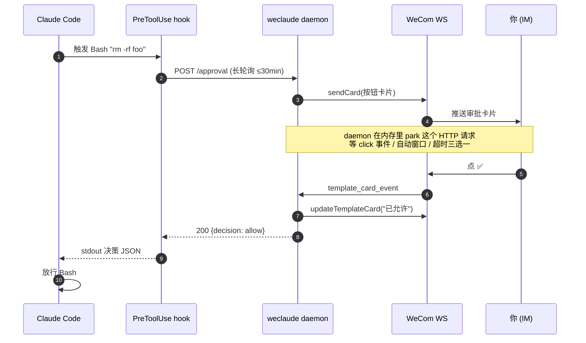
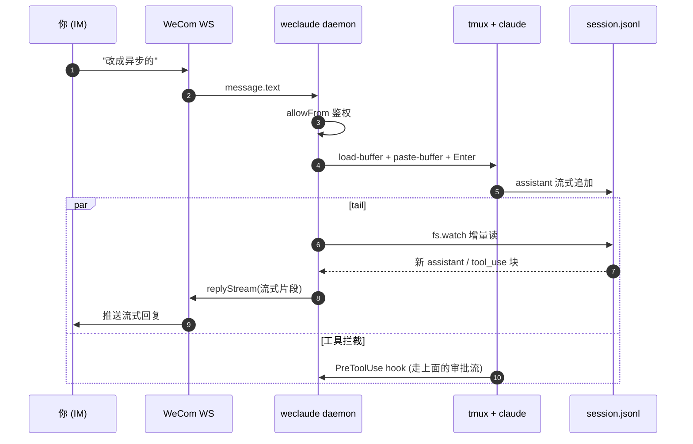

# weclaude

**把 Claude Code 装进企业微信。** 在地铁上、被窝里、开会摸鱼时，照样能跟你电脑上的 Claude 干活。


- 🛎 **远程审批** — Claude 要跑 `Bash` / `Edit`？审批卡片直推 IM，点 ✅/❌/⏱（放行 N 分钟）。
- 📋 **计划审批** — Claude 在 plan mode 结束（`ExitPlanMode`）时，把计划摘要 + 审批卡推到 IM：点 ✅同意 让它退出 plan mode 开始执行，或 ✏️继续改 让它留在 plan mode 继续完善。同 `AskUserQuestion` 多选题也镜像为投票卡。
- 🪞 **会话镜像** — 你电脑上跑的 Claude 流式打字、tool_use、思考过程，实时同步到企业微信；IM 里发消息原样落进 CLI 输入框。
- 🖼 **图片直贴** — 企业微信发图，自动走 macOS 剪贴板 + tmux 粘贴，Claude 当贴图处理（不走 Read，不耗 token）。
- 🔍 **细节页** — 工具调用 / 审批请求都生成本地 HTML 详情页，IM 里点链接看完整 input / result / git diff。
- 📡 **MCP 主动推送** — Claude 通过 `wecom__send_markdown` / `wecom__send_card` / `wecom__ask_user` 主动汇报或问询。
- 📄 **文档读写** — Claude 通过 `wecom_doc_list_tools` / `wecom_doc_call` 直接调企业微信智能机器人的 doc / smartsheet / smartpage MCP，新建在线文档、写 Markdown、读链接、操作智能表格——全程在内网，不需要 corp access_token。
- 🗂 **多会话发现/切换** — Claude 通过 `list_claude_sessions` / `switch_claude_session` / `new_claude_session` 列出本机 tmux 内所有在跑的 Claude 会话（带摘要 + 稳定动物 emoji 标签）、把 IM 镜像切到其中任一个、或在指定路径新开一个会话。审批卡标题也带同一枚 emoji，多个会话兜底到同一 IM 时一眼区分。

---

## 快速开始

**前置**：macOS / Linux、Node ≥ 20、PATH 里能找到 `claude` 或 `claude-internal`、企业微信「智能机器人」的 `botId` + `secret`。镜像模式额外需要 `tmux`。

```bash
npm install -g weclaude
weclaude init
```

`init` 会交互式问你 4 个问题，把配置落到 `~/.weclaude/`：

| 问什么 | 落到哪 |
| --- | --- |
| botId / secret | `~/.weclaude/secrets.json` |
| 用哪个 Claude（`claude` / `claude-internal` / 自定义路径） | `~/.weclaude/config.jsonc` |
| 用哪种模式（`headless` / `mirror`，见下文） | `~/.weclaude/config.jsonc` |
| 是否开启 PreToolUse 远程审批 | `~/.weclaude/config.jsonc` |

然后自动：编译 → 注入 hook/MCP → 装常驻 daemon（macOS launchd / Linux systemd --user）→ 等 WebSocket 鉴权。

**最后一步：绑定默认会话。** CLI 提示后，**在企业微信里**给机器人发：

```
将本对话设置为默认会话
```

这是**唯一**绕过白名单的入口，10 分钟窗口，消费完立刻关。后续所有消息都按白名单鉴权。

### 其它安装方式 / 内网与无 systemd 环境

**从某个 fork / 分支装（自带改动的版本）**：`dist/` 不入库，但 `prepare` 脚本会在 git 安装时自动编译，所以可以直接：

```bash
npm i -g github:<你的用户名>/weclaude          # 默认分支
npm i -g github:<你的用户名>/weclaude#<分支名>   # 指定分支
```

**内网 / 需要正向代理**：weclaude 的出站（WeCom WebSocket、智能机器人文档 MCP）会读环境变量里的代理。安装与运行都带上 `HTTPS_PROXY`：

```bash
HTTPS_PROXY=http://your-proxy:port npm i -g github:<你的用户名>/weclaude
# 也可在 config.jsonc 写死: bot.proxy = "http://your-proxy:port"（优先级高于环境变量）
```

daemon 进程同样需要能读到代理变量（见下方守护脚本里 `export HTTPS_PROXY`）。

**无 systemd 的环境（容器等）**：`init` 装 daemon 这步在 macOS 走 launchd、Linux 走 `systemd --user`。若机器没有 systemd user session（很多容器：PID 1 非 systemd、无 `XDG_RUNTIME_DIR`），这步会失败——其余配置（hook / MCP / 插件）已生效，只差 daemon 没被托管。用一个简单的重启循环守护即可，存成 `~/.weclaude/daemonctl.sh`：

```bash
#!/usr/bin/env bash
# 无 systemd 时的 weclaude daemon 守护：setsid 脱离终端的重启循环。
set -uo pipefail
REPO="$(npm root -g)/weclaude"
NODE="$(command -v node)"
WC="$HOME/.weclaude"; PIDFILE="$WC/supervisor.pid"; LOG="$WC/daemon.log"
mkdir -p "$WC"
# 内网：daemon 出站要走代理。按需改成你的代理地址，或删掉这两行。
export HTTPS_PROXY="${HTTPS_PROXY:-http://your-proxy:port}"; export https_proxy="$HTTPS_PROXY"
export NO_PROXY="${NO_PROXY:-127.0.0.1,localhost}"; export no_proxy="$NO_PROXY"
is_running(){ [[ -f "$PIDFILE" ]] && kill -0 "$(cat "$PIDFILE")" 2>/dev/null; }
case "${1:-start}" in
  start)   is_running && { echo "already running"; exit 0; }
           setsid bash "$0" __loop </dev/null >>"$LOG" 2>&1 & echo $! >"$PIDFILE"
           sleep 2; echo "[daemonctl] started (pid $(cat "$PIDFILE"))" ;;
  __loop)  while [[ -f "$PIDFILE" ]]; do "$NODE" "$REPO/dist/daemon/index.js" >>"$LOG" 2>&1
             [[ -f "$PIDFILE" ]] || break; sleep 5; done ;;
  stop)    [[ -f "$PIDFILE" ]] && { pid=$(cat "$PIDFILE"); rm -f "$PIDFILE"
             pkill -P "$pid" 2>/dev/null||true; kill "$pid" 2>/dev/null||true; }
           pkill -f "$REPO/dist/daemon/index.js" 2>/dev/null||true; echo "[daemonctl] stopped" ;;
  restart) bash "$0" stop; sleep 1; bash "$0" start ;;
  status)  is_running && echo "running (pid $(cat "$PIDFILE"))" || echo "stopped"
           curl -sS -m2 http://127.0.0.1:17890/status 2>/dev/null && echo || echo "(HTTP :17890 无响应)" ;;
esac
```

```bash
chmod +x ~/.weclaude/daemonctl.sh
~/.weclaude/daemonctl.sh start    # 起 daemon（自带崩溃重启）
~/.weclaude/daemonctl.sh status   # 看状态
```

容器重启不会自动拉起 daemon——把 `~/.weclaude/daemonctl.sh start` 加进 shell profile 或容器入口即可（幂等，已在跑就 no-op）。

---

## 两种模式怎么选

|  | `headless` | `mirror` 🌟 |
| --- | --- | --- |
| **怎么跑** | IM 来消息 → 后台 `claude -p` 跑一轮 | IM 来消息 → tmux 粘进活的 TUI |
| **CLI 看得见吗** | 看不见（headless 子进程） | 看得见（IM 消息像你自己敲进去的） |
| **状态续接** | 靠 `--resume <sid>` 续 session | 一对一绑定 IM 聊天 ↔ tmux 窗口，原地累计 |
| **流式输出** | 转发 assistant 文本块 | 完整流式：打字机、tool_use、思考过程都看得到 |
| **适合谁** | 简单单轮问答 / CI 类自动化 | 真·远程结对编程 |

镜像模式下，IM 里发 `/new` 直接开新 tmux 窗口 + 新 Claude 会话；`/clear` 清当前上下文；带图消息自动注入剪贴板。所有 IM 聊天共享一个 tmux session（默认名 `weclaude`），每个聊天一个独立 window，重启 daemon、关 tmux 都能自愈。

**IM 斜杠命令**（镜像模式，全部由 daemon 直接处理、**永不注入被镜像的会话**——所以即便当前会话卡死也照常生效）：

| 命令 | 作用 |
| --- | --- |
| `/sessions` | 列出本机所有在跑的 Claude 会话（带摘要 + 稳定动物 emoji 标签），标出当前镜像的那个 |
| `/sessions <emoji 或 id>` | 把本聊天的镜像切到指定会话（支持动物 emoji、完整 sessionId、或 ≥6 字符前缀） |
| `/escape` | 一键逃生：切到最近活跃的**其它**会话；没有则新开一个（新会话天生 auto 模式） |
| `/auto` | 把当前镜像的会话切到 auto 权限模式（经 Shift+Tab 循环，读 TUI footer 精确落位；卡死的会话切不动，用 `/escape`） |

> 💡 IM 输入法常在 emoji / 命令后插入零宽字符（word-joiner、变体选择符等），weclaude 会在匹配前统一剥离，所以手机上发 `/sessions 🐼` 不会因为看不见的尾巴而匹配失败。

> 💡 **mirror 不要求你必须先在 CLI 里开 tmux**：在企业微信里直接发 `/new` 就能从零起一个新 tmux 窗口 + Claude 会话；甚至首次发任意消息都会自动 spawn + 绑定（首条消息既是绑定信号也是第一句 prompt）。回家打开终端 `tmux attach -t weclaude` 接管即可。

---

## 体验是什么样

**审批场景**：

> 你正在地铁上，电脑上的 Claude 想 `rm -rf node_modules` 重装。企业微信叮一声弹卡片：
>
> > 🛎 授权请求: Bash
> > `rm -rf node_modules`
> > [✅ 允许] [❌ 拒绝] [⏱ 5 分钟内自动允许]
>
> 你点 ✅，卡片立刻刷新成 `✅ Bash · 已允许`，电脑上的 Claude 解除阻塞继续跑。

**镜像场景**：

> 你 tmux 里开着 Claude 在写代码。出门后给机器人发：
>
> > 把刚才那个函数改成异步的
>
> 这条消息自动粘进 CLI 输入框 + 回车提交。Claude 的回应、调用了哪些工具、改了哪些文件，逐字流式推回你 IM。回家打开终端，对话一字不少都在那里。

**文档场景**：

> 你给 Claude 说："周报给我整理成一篇企业微信文档"。Claude 自己调 `wecom_doc_list_tools` 看可用方法，再调 `wecom_doc_call` 走 `create_doc` 新建文档、`edit_doc_content` 写入 Markdown，最后把链接贴回会话——全程不离开 Claude，文档归属到你的 userid，每日 20 篇限额按 userid 计。

---

## 文档 / 智能表格 / 智能文档

`weclaude` 把企业微信智能机器人的远端 MCP（doc / smartsheet / contact 等）桥接到本地 Claude，**不走 corp access_token**：daemon 直接复用 botId+secret 的 WS 长连，通过 `aibot_get_mcp_config` 命令拉到每个 category 的 Streamable HTTP MCP URL，再以 JSON-RPC 调 `tools/list` / `tools/call`，`x-openclaw-wecom-userid` header 透传文档归属人。

**前置一次性授权**：在企业微信「工作台 - 智能机器人 - 你的机器人 - 可使用权限」里勾选「文档」「智能表格」对应能力。第一次调用如果未授权，远端会返回结构化错误（errcode 851013）+ 授权链接，原样转给 Claude，照着点同意即可。

**Claude 侧自动发现**：模型先调一次 `wecom_doc_list_tools(category="doc")` 拿到工具列表（`create_doc` / `edit_doc_content` / `smartpage_create` / `upload_doc_image` ...）和入参 schema，再用 `wecom_doc_call(category, method, args)` 执行。category 当前可选：

| category | 能干嘛 |
| --- | --- |
| `doc` | 在线文档、智能文档、文档图片上传 |
| `smartsheet` | 智能表格的字段 / 记录读写 |
| `contact` | 通讯录查询（按需授权） |

**curl 验证**：

```bash
# 列 doc 类目下所有可用工具
curl -sS -X POST http://127.0.0.1:17890/wedoc/list \
  -H 'content-type: application/json' \
  -d '{"category":"doc"}'

# 创建一篇文档
curl -sS -X POST http://127.0.0.1:17890/wedoc/call \
  -H 'content-type: application/json' \
  -d '{"category":"doc","method":"create_doc","args":{"doc_type":3,"doc_name":"demo"}}'

# 写入 Markdown
curl -sS -X POST http://127.0.0.1:17890/wedoc/call \
  -H 'content-type: application/json' \
  -d '{"category":"doc","method":"edit_doc_content",
       "args":{"docid":"<返回的 docid>","content_type":1,"content":"# 标题\n正文"}}'

# 授权变更后清缓存
curl -sS -X POST http://127.0.0.1:17890/wedoc/invalidate -H 'content-type: application/json' -d '{}'
```

`requesterUserId` 解析顺序：调用方显式传入 → `defaultChat` 的 `user:<id>` 部分 → 不传（远端会拒，错误原样回到 Claude，比 daemon 提前判更透明）。

---

## 消息是怎么同步的

**审批流**（`headless` / `mirror` 都走这条）：



**镜像流**（`mirror` 模式，IM ↔ tmux 双向）：



要点：
- daemon 是**唯一**和 WeCom 说话的进程，hook 和 MCP 都只是它的 HTTP 客户端
- 审批是**长轮询 + 内存 park**，没有 webhook、不依赖外网回调
- 镜像是**单向 paste + 单向 tail**：IM→tmux 走粘贴键，tmux→IM 走读 jsonl，两条管道独立、互不阻塞

---

## 常用命令

```bash
weclaude status              # 看 daemon + WS 健康
weclaude logs -f             # 实时日志
weclaude send <chat> <text>  # 主动推消息
weclaude reload              # 重启 daemon（改了配置后用）
weclaude unsync              # 卸载 hook/MCP（保留 daemon）
weclaude uninstall           # 完整卸载（先于 npm uninstall）
```

> ⚠️ **卸载顺序**：先 `weclaude uninstall` 再 `npm uninstall -g weclaude`。否则 launchd/systemd 会一直尝试拉起已删除的二进制。`~/.weclaude/` 下的 config/secrets 不会被清，二次安装可无缝复用。

---

## 常见问题

**Q: hook 不触发？**
`cat ~/.claude/settings.json | jq .hooks.PreToolUse`，没东西就跑 `weclaude sync` 重写。

**Q: 卡片点了没反应？**
企业微信卡片就地刷新只有 5 秒窗口，超时不刷新是正常的，决策本身仍然生效。

**Q: daemon 起不来？**
`weclaude logs -f` 看；常见是 `botId` / `secret` 写错卡在 WebSocket 鉴权。

**Q: 多机部署？**
`config.jsonc` 可以纳入 dotfiles；`secrets.json` 每台机器独立填。第二台机器跑 `weclaude init` 会跳过覆盖提示，但仍要重新走 claim 步骤拿本机 IM principal。

---

## 架构一瞥

三个进程走 `127.0.0.1:17890` + `~/.weclaude/`：

```
 WeCom ── WebSocket ──► daemon (常驻, launchd/systemd)
                          │
                          ├── HTTP :17890 ◄── hook (pre-tool-use.sh, 长轮询)
                          ├── HTTP :17890 ◄── MCP server (claude 的 stdio 子进程)
                          └── spawn `claude -p` (headless)  或  tail jsonl + tmux paste (mirror)
```

daemon 是**唯一**持有 WeCom WS 连接的进程，hook 和 MCP 都是它的薄 HTTP 客户端。

详情看 [CLAUDE.md](CLAUDE.md)。

## Contributors

- zhenwwang <zwwang96@gmail.com>

## License

MIT
