# thinkStyle 设计文档

> Brief 模式的子模式：把 reasoning / tool calls / tool results 以 `<think>…</think>` 折叠块实时流入聊天气泡，最终答复跟在 `</think>` 之后。

---

## 1. 配置

```jsonc
// ~/.wezard/config.jsonc → wrc.mirror
{
  "brief": true,          // 前置条件：必须开启 brief 模式
  "thinkStyle": true      // 开关。运行时 flag = thinkStyle && brief
}
```

`shared/config.ts:100-104` 定义 schema。运行时在 `mirror-bridge.ts:1938` 取值：

```ts
const thinkStyle = cfg.wrc.mirror.thinkStyle && cfg.wrc.mirror.brief;
```

两处传入 `startMirrorTail` 的 `TailDeps.thinkStyle`（`mirror-bridge.ts:3307, 3675`），
控制 parser 是否向下游 emit `kind: "thinking"` 和 `kind: "tool_use"`（thinkStyle 下
即使 `includeTools=false` 也会 emit tool_use — 用于 think 流的 `🔧` 行）。

---

## 2. 总体架构

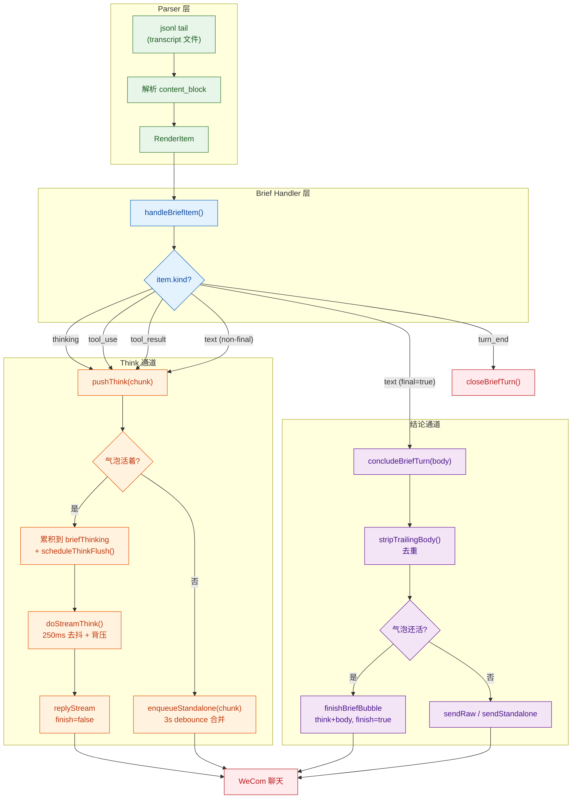

三层职责明确：**Parser** 只管解析和 emit，**Handler** 只管路由，**Delivery** 分两条管道各自处理 stream 和 standalone。

---

## 3. 与非 thinkStyle brief 模式的关键差异

| 维度 | 非 thinkStyle (默认) | thinkStyle |
|------|---------------------|------------|
| 详情链接 | 每个 turn 开头推 `[🧙](url)` | **全程不发**。`linkedTagPrefix()` 返回空串 |
| 气泡开流 | 立即发 `"…"` placeholder | `streamPending=true`，延迟到首个 content 到达 |
| thinking | parser 丢弃，只写 detail store | parser emit → `pushThink()` 累积到 `briefThinking` |
| tool_use | 按 `includeTools` 决定是否渲染 | 无论 `includeTools`，渲染为 `🔧 [Name compact](url)` 进 think |
| tool_result | 按 `includeToolResults` 走常规渲染 | 渲染为 `↳ 单行摘要` 进 think |
| 非 final text | earlyLinkBubble (收气泡) | `pushThink()` 进 think 流，不收气泡 |
| final text | concludeBriefTurn 走 standalone / 写气泡 | 与 think 拼成 `<think>…</think>\n\n正文` |
| earlyTimer (3s) | 设置 | **不设置**（气泡保持开放等 thinking 流入） |
| 无气泡 turn | 推详情链接 | 保持静默，最终答复走 standalone |

对比流程图：

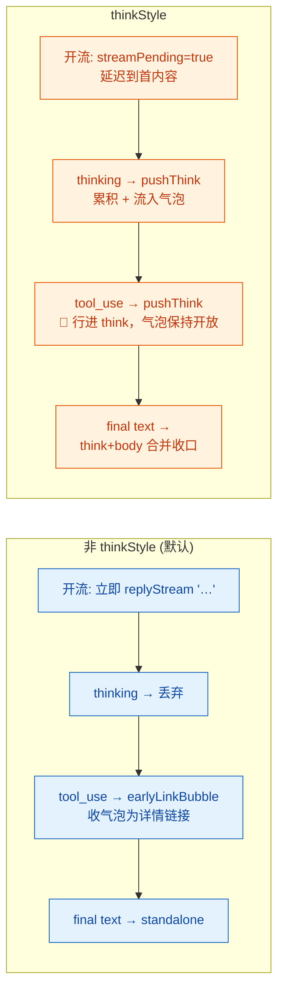

---

## 4. 气泡状态机

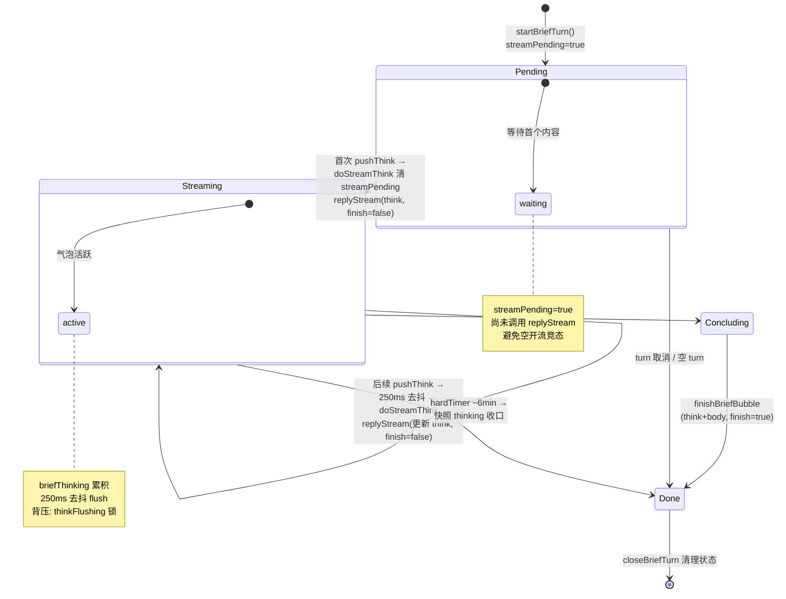

### 状态字段

**BriefBubble 上**（`mirror-bridge.ts:1737-1751`）：

| 字段 | 类型 | 用途 |
|------|------|------|
| `streamPending` | `boolean?` | thinkStyle 延迟首条 replyStream；doStreamThink 首次调用时清为 false |

**AttachState 上**（`mirror-bridge.ts:1867-1872`）：

| 字段 | 类型 | 用途 |
|------|------|------|
| `briefThinking` | `string?` | 气泡存续期间累积的 thinking 内容（段间 `\n\n` 分隔）；气泡收口后清空 |
| `thinkFlushTimer` | `Timeout?` | 去抖定时器，FLUSH_MS (250ms) 后触发 doStreamThink |
| `thinkFlushing` | `boolean?` | 背压标记：上一次 replyStream 在途时挡住新 flush |

---

## 5. 核心函数

### `pushThink(a, chunk)` — 唯一入口

`mirror-bridge.ts:2511-2521`

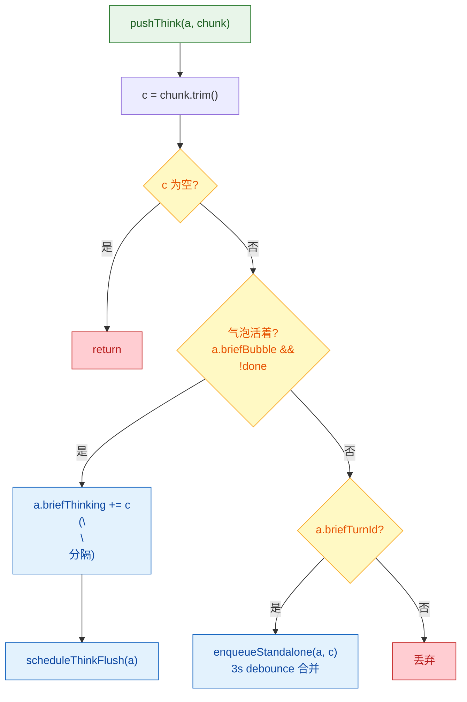

### `scheduleThinkFlush(a)` — 去抖编排

`mirror-bridge.ts:2498-2506`

- 前置守卫：气泡存在 + 未 done + 无 pending timer + 不在 flushing
- 250ms 后触发 `doStreamThink()`
- 背压：上一次在途 → 本次排走下一个 pushThink 触发

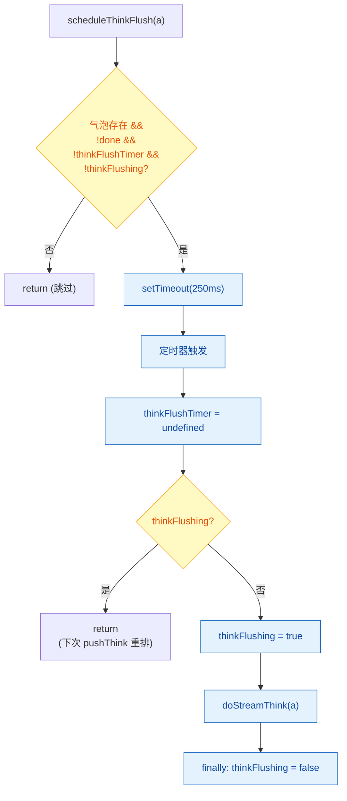

### `doStreamThink(a)` — 实际流写

`mirror-bridge.ts:2485-2497`

- 首次调用清 `streamPending`（解决 off-by-one 竞态）
- `replyStream(frame, streamId, openThink(target, think), false)` — 不关流
- 错误只 log 不 throw（不打断工作流）

### `stripTrailingBody(think, body)` — 去重

`mirror-bridge.ts:507-515`

解决：软后端 final text 先作为 non-final 进了 `briefThinking`，收口时再当 body 用 → 重复。
策略：如果 `think` 尾部恰好等于 `body`，剥掉那段（含前面的空行）。只剥完整尾段，中途出现过的同句子不动。

```mermaid
flowchart TD
    Entry["stripTrailingBody(think, body)"]
    Entry --> NullCheck{"think 或 body<br/>为空?"}
    NullCheck -->|是| RetThink["return think || undefined"]
    NullCheck -->|否| Equal{think === body?}
    Equal -->|是| RetNone["return undefined<br/>(全重复)"]
    Equal -->|否| EndsWith{think.endsWith(body)?}
    EndsWith -->|是| Cut["cut = think.slice(0, -body.length)<br/>.replace(/\\n{2,}$/, '')<br/>.trimEnd()"]
    Cut --> CutEmpty{cut 为空?}
    CutEmpty -->|是| RetNone2["return undefined"]
    CutEmpty -->|否| RetCut["return cut"]
    EndsWith -->|否| RetOriginal["return think<br/>(无重复)"]

    classDef decision fill:#FFF9C4,stroke:#F9A825,color:#E65100
    classDef action fill:#E3F2FD,stroke:#1565C0,color:#0D47A1
    class NullCheck,Equal,EndsWith,CutEmpty decision
    class Cut,RetThink,RetNone,RetNone2,RetCut,RetOriginal action
```

### `rescueBodyFromThinking(thinking)` — 兜底提取

`mirror-bridge.ts:519-526`

当 turn 收口时无 formal body（只有 thinking），从 thinking 的末尾段落中倒序跳过工具行（`🔧` / `↳`），取第一个文本段落作为 body。防止 thinking 内容静默丢失。

### `linkedTagPrefix()` — 链接抑制

`mirror-bridge.ts:2139-2145`

thinkStyle 下直接返回空串 → 所有消息退回 `withSessionTag`（无详情链接）。

---

## 6. 完整生命周期时序图

### 6.1 正常 Turn (Happy Path)

用户从 WeCom 发消息，LLM 经历 thinking → 工具调用 → 工具返回 → 最终回复。

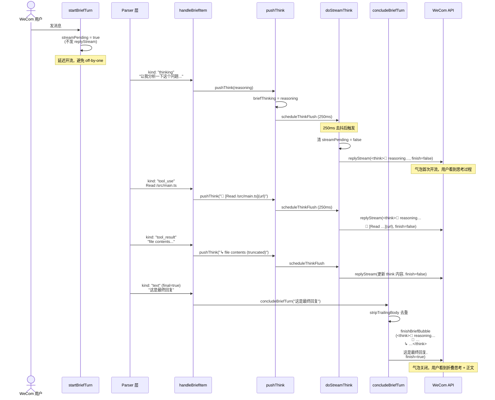

### 6.2 软后端路径 (final=undefined)

CodeBuddy 后端的 jsonl 按完整消息落盘（非增量），text 没有明确 `final` 标记。

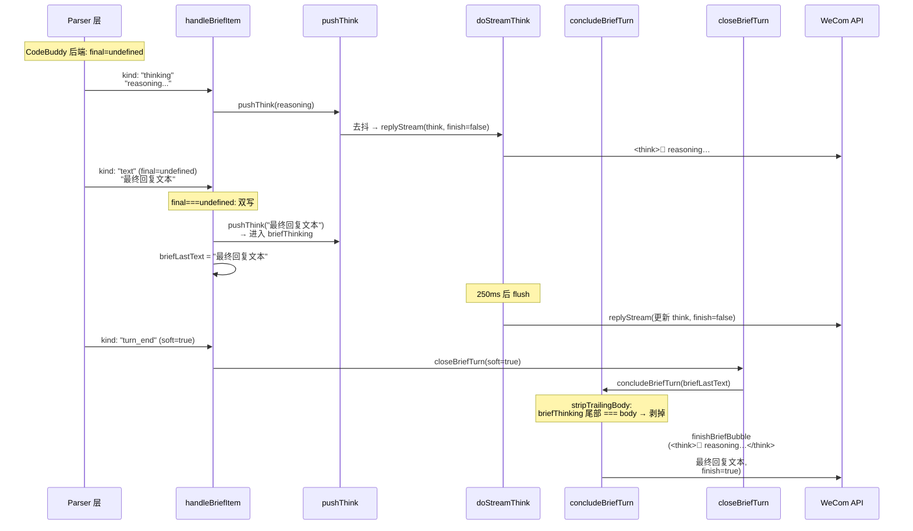

### 6.3 hardTimer 超时 (~6min)

LLM 长时间执行（大量工具调用），WeCom stream 窗口到期。

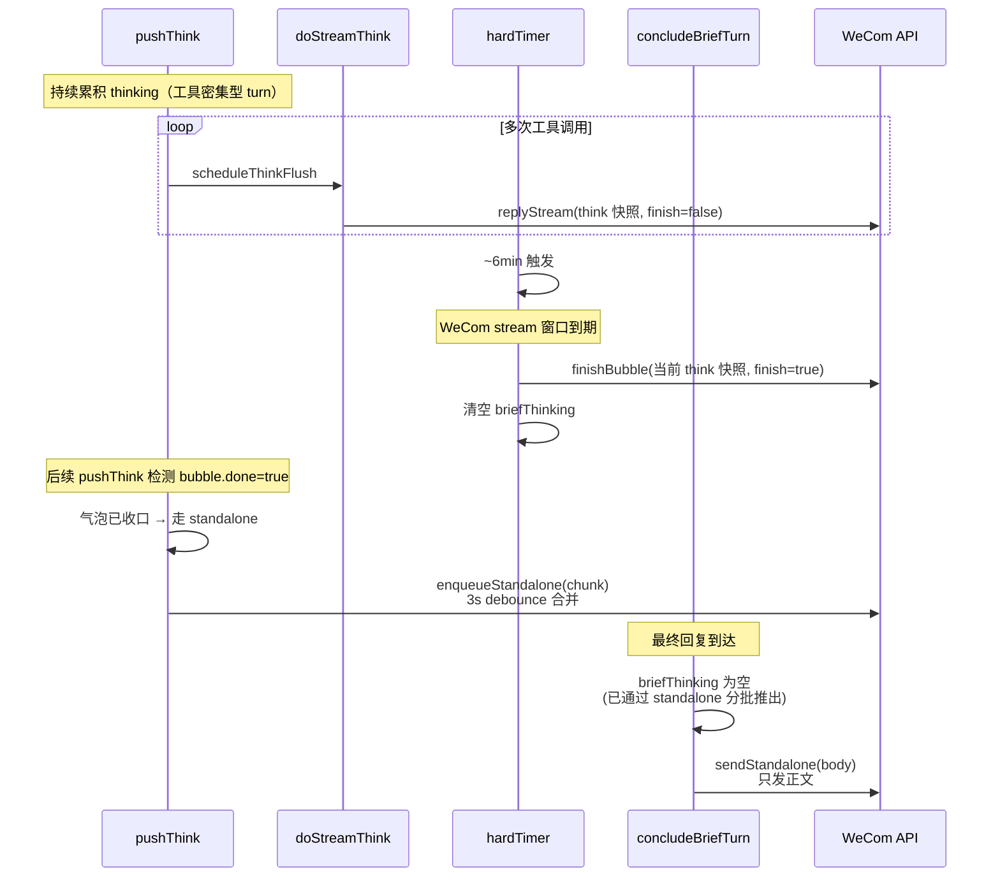

---

## 7. concludeBriefTurn 详解

`mirror-bridge.ts:2657-2690`

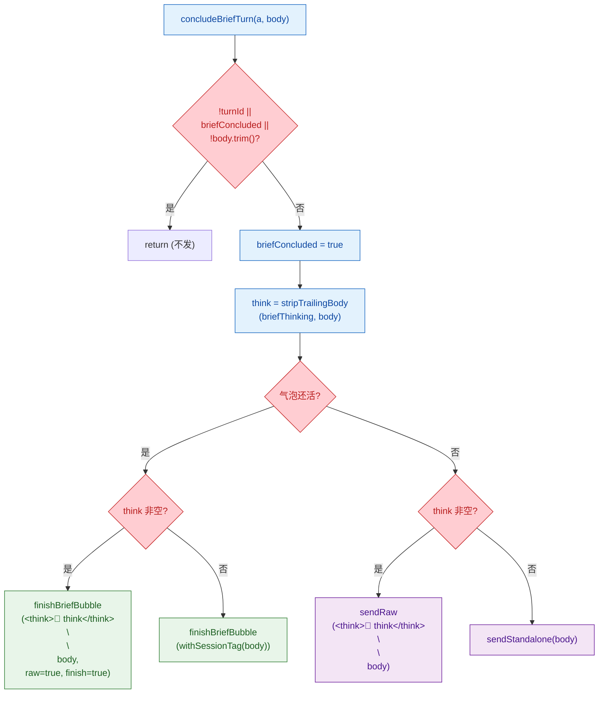

核心逻辑：**有 think 则合并 `<think>…</think>\n\nbody`，无 think 则只发 body。** 气泡活着走 `finishBriefBubble`（更新已有气泡），否则走 `sendRaw`/`sendStandalone`（新发一条）。

---

## 8. closeBriefTurn 清理流程

`mirror-bridge.ts:2694-2744`

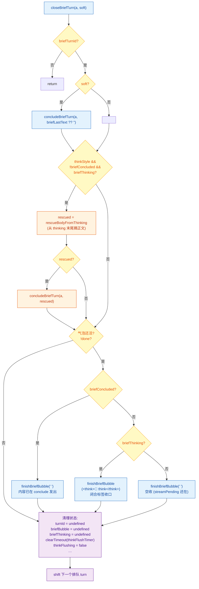

三层兜底设计：
1. **soft conclude** — 用 `briefLastText` 尝试结论
2. **rescue** — `briefLastText` 为空但有 `briefThinking` → 从中摘出正文
3. **气泡收口** — 确保气泡不会永远挂着（已结论空收 / 未结论用闭合 `</think>` 收 / 空收）

---

## 9. handleBriefItem 路由逻辑

`mirror-bridge.ts:2820-2920`

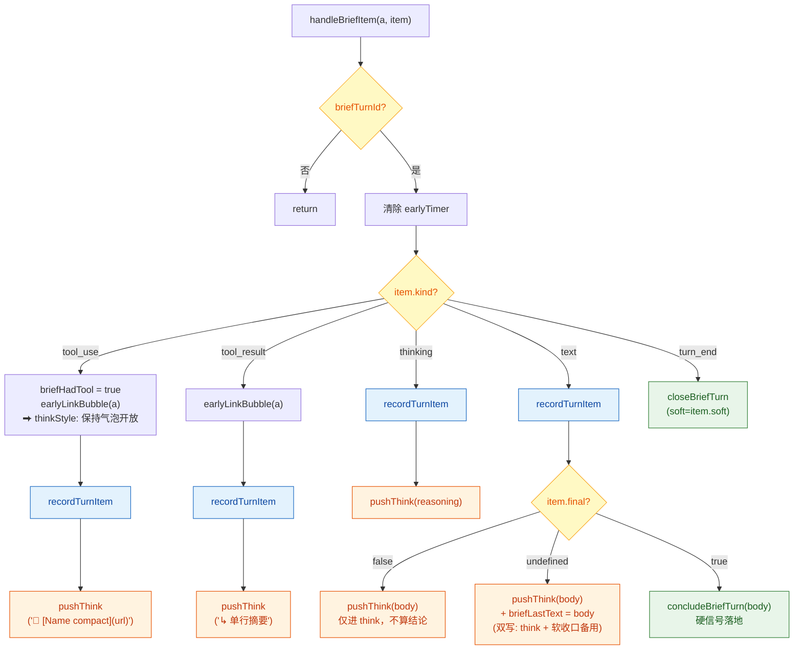

关键路由规则：

| item.kind | thinkStyle 行为 |
|-----------|----------------|
| `thinking` | parser 仅在 thinkStyle=true 时 emit → `pushThink(reasoning)` |
| `tool_use` | 无论 `includeTools` 设置，渲染为 `🔧 [Name compact](url)` → `pushThink` |
| `tool_result` | `↳ 单行摘要` → `pushThink` |
| `text` final=false | 确知中途 → 仅 `pushThink`，不设 `briefLastText` |
| `text` final=undefined | 不确定 → `pushThink` + 写 `briefLastText`（双写策略） |
| `text` final=true | 硬信号 → `concludeBriefTurn(body)` |
| `turn_end` | → `closeBriefTurn(soft)` |

---

## 10. Stream 流控：去抖 + 背压

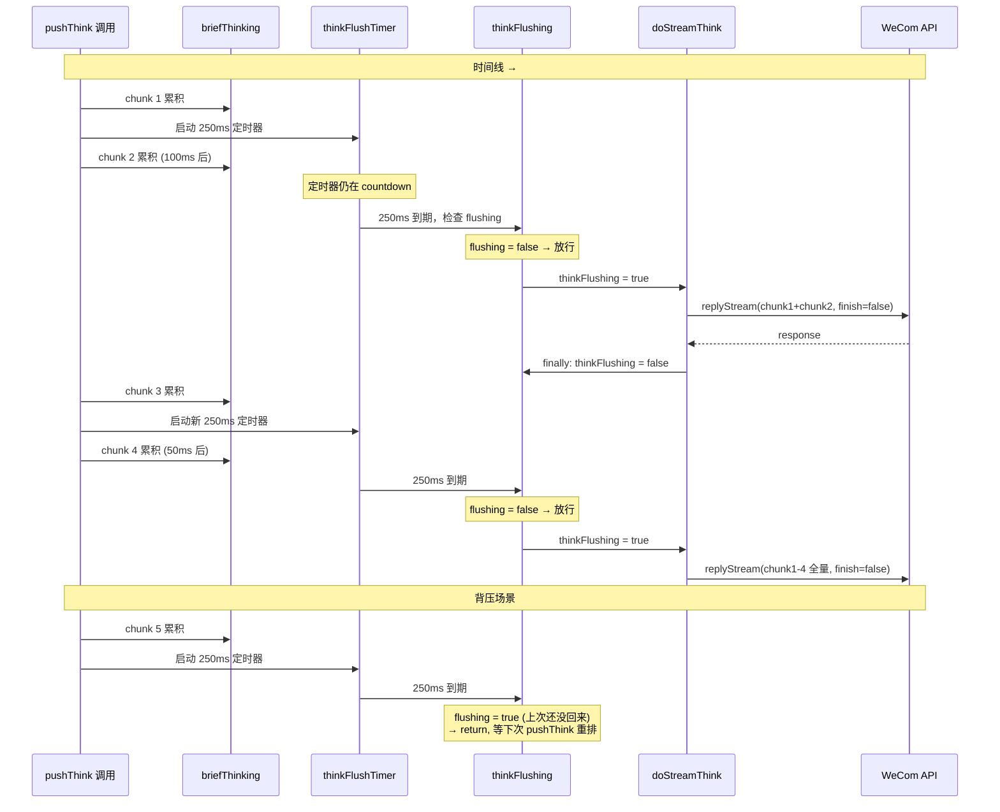

设计要点：
- **去抖 250ms**：把高频的 thinking 输出合并成批次更新，减少 replyStream 调用
- **背压**：上一次 replyStream 还在途时，新的 flush 不排，等下一次 pushThink 重新触发
- **全量更新**：每次 doStreamThink 发送的是 `briefThinking` 的完整内容（非增量），WeCom 气泡内容被整体替换

---

## 11. 消息输出格式

### Stream 阶段（气泡更新中）

```
<think>🧙 让我分析一下这个问题...

首先需要读取配置文件。

🔧 [Read /src/config.ts](https://...)

↳ export const config = { port: 3000, ... }

看起来端口配置在这里，需要修改。
```

### 收口阶段（气泡最终形态）

```
<think>🧙 让我分析一下这个问题...

首先需要读取配置文件。

🔧 [Read /src/config.ts](https://...)

↳ export const config = { port: 3000, ... }

看起来端口配置在这里，需要修改。</think>

端口已从 3000 改为 8080，修改位于 `/src/config.ts:3`。
```

WeCom 会将 `<think>…</think>` 渲染为折叠块，用户展开可看完整思考过程。

### 多 agent 场景（带 tag）

```
<think>🔧修复 #fix 让我检查错误日志...

🔧 [Bash grep -n "error"](https://...)

↳ line 42: TypeError: Cannot read property 'x'</think>

已修复 `line 42` 的空指针问题，添加了 optional chaining。
```

---

## 12. 边界场景处理

### 12.1 off-by-one 竞态

`mirror-bridge.ts:2607-2612`

**问题**：空 `<think>` + 紧随 `pushThink` = 两次快速 `replyStream` → WeCom 服务端合并/丢弃。

**方案**：`bubble.streamPending = true`，首条 `doStreamThink` 才发出第一次 replyStream，携带真实内容。

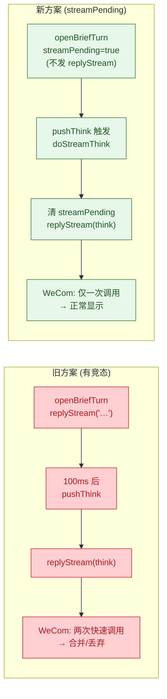

### 12.2 软后端去重

`mirror-bridge.ts:2887-2891`

CodeBuddy 后端的 `final===undefined` 文本会同时 `pushThink` 和写 `briefLastText`：

```
briefThinking = "reasoning…\n\n最终回复文本"    ← pushThink 写入
briefLastText = "最终回复文本"                   ← 同时记录

软收口时:
  concludeBriefTurn("最终回复文本")
  → stripTrailingBody("reasoning…\n\n最终回复文本", "最终回复文本")
  → "reasoning…"                                 ← 尾部重复被剥掉
  → 输出: <think>🧙 reasoning…</think>\n\n最终回复文本
```

### 12.3 thinking rescue

`mirror-bridge.ts:2701-2706`

Turn 将收口但 `briefConcluded=false` 且有 `briefThinking` → 从中摘出 body。

```
briefThinking = "分析了一下...\n\n🔧 [Read ...](url)\n\n↳ contents\n\n结论是XYZ"

rescueBodyFromThinking 倒序遍历段落:
  ✗ "↳ contents"     (工具结果行，跳过)
  ✗ "🔧 [Read ...]"  (工具调用行，跳过)
  ✓ "结论是XYZ"       → 作为 body 传给 concludeBriefTurn
```

### 12.4 WeCom stream 窗口超时 (~6min hardTimer)

`mirror-bridge.ts:2571-2584`

- 气泡必须 `finish=true` 收口（WeCom 限制）
- thinkStyle：把当前 `briefThinking` 作为快照写入气泡，然后清空 `briefThinking`
- 后续 `pushThink` 检测到气泡不可用，走 `enqueueStandalone` 直接推送到 chat
- `concludeBriefTurn` 时 `briefThinking` 为空（已通过 standalone 分批推出），只发 body

### 12.5 排队 turn 取消

`mirror-bridge.ts:2759-2761`

- thinkStyle：排队气泡收为 `"⏳ (queued, cancelled)"`（无链接）
- 非 thinkStyle：收为详情链接

### 12.6 气泡收口 (closeBriefTurn)

`mirror-bridge.ts:2711-2728`

三种情况：
1. **已结论**（`briefConcluded`）→ 气泡收为空白（内容已在 conclude 阶段发出）
2. **未结论 + 有 thinking** → 以 `<think>…</think>`（闭合标签）收口，避免 WeCom 渲染乱版
3. **未结论 + 无 thinking**（`streamPending` 还在）→ 空收

---

## 13. Parser 层面

`mirror-bridge.ts:730-741`

```ts
// tool_use: thinkStyle 下即使 includeTools=false 也 emit (用于 think 流的 🔧 行)
} else if (b?.type === "tool_use" && (deps.includeTools || deps.thinkStyle)) {
  ...
// thinking: 仅 thinkStyle 时 emit
} else if (b?.type === "thinking" && deps.thinkStyle) {
  ...
}
```

非 thinkStyle 时 thinking blocks 被静默跳过（`只进详情, 不下发`）。

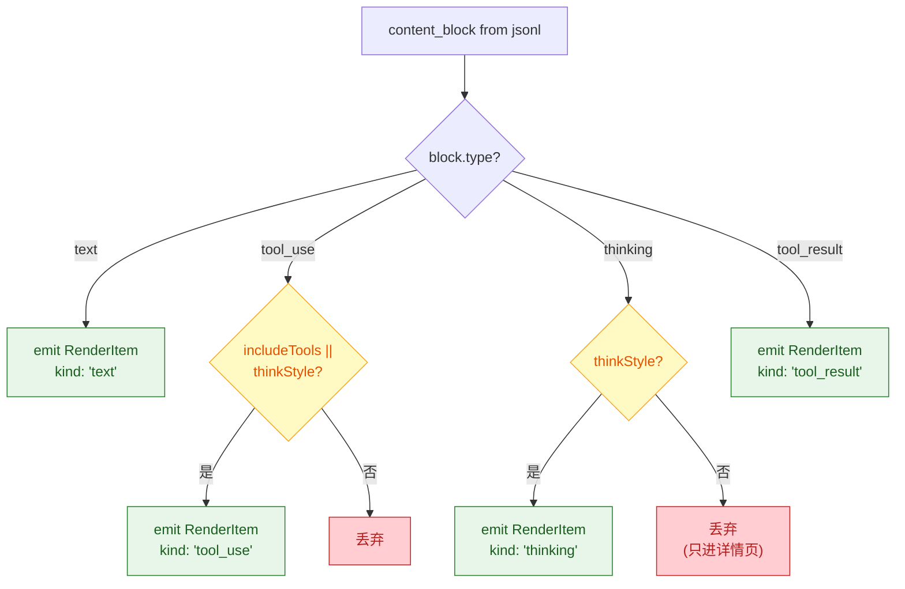

---

## 14. 端到端数据流总览

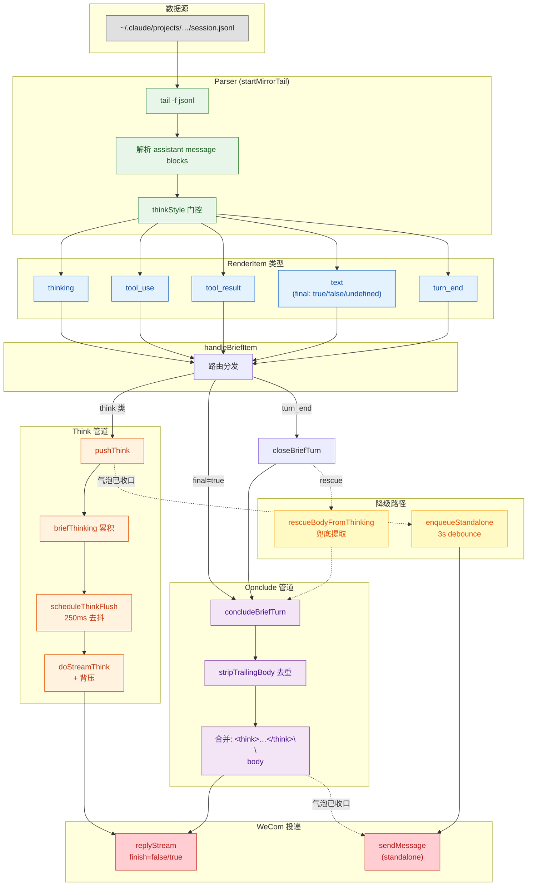
